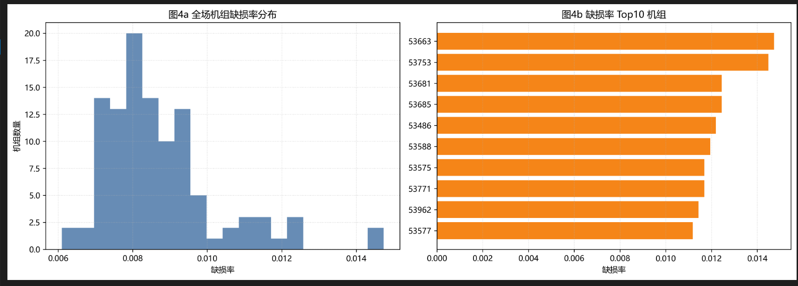
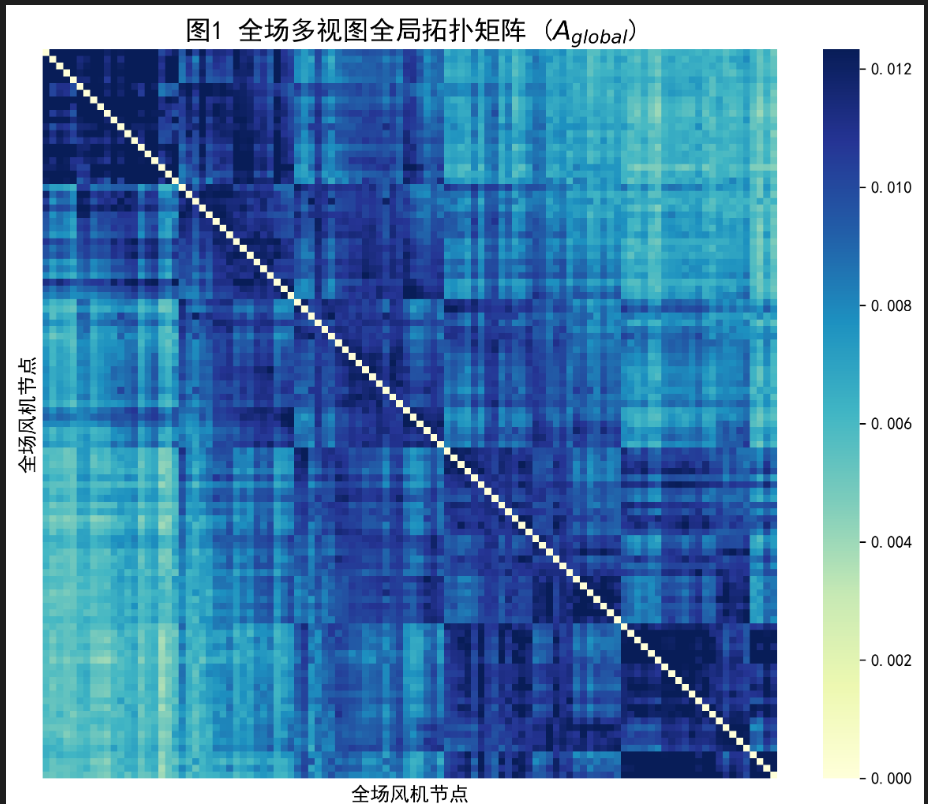
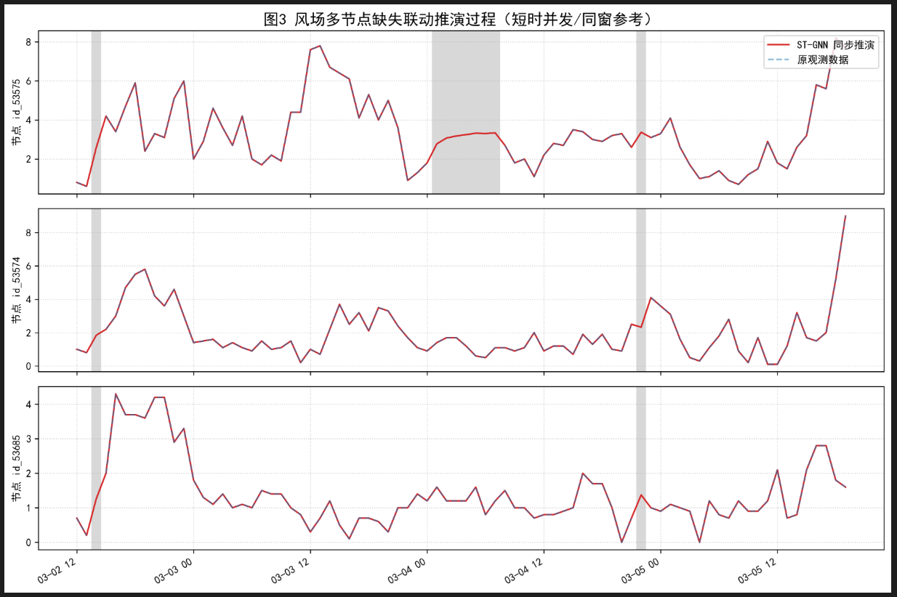
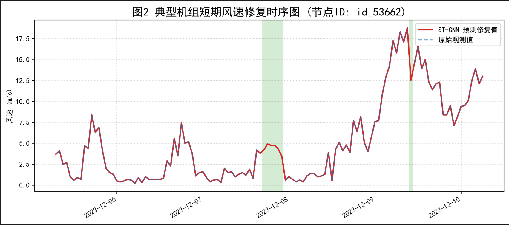

# 基于多视图拓扑与掩码图网络的风场全局同步演化校正模型

## 1. 研究背景与核心痛点

风电场由于通信故障、传感器异常或极端天气，常出现风速数据的大规模、并发性缺失。传统的数据插补方法（如均值填充、单变量时序回归）或局部近邻启发式搜索算法（Ego-Graph 回归）在处理此类问题时存在根本性缺陷：它们将风场中高度耦合的风机割裂为孤立的个体，在面临多机位并发缺失时，由于局部参考节点的丢失，模型往往会发生退化甚至崩溃。

> (图 4 说明：全场 108 台机组缺损率分布及 Top 10 严重缺失机组。大量机组缺失率高达 10%~12%，且呈现高并发特征，说明该任务不是“少量孤立点插值”，而是典型的全场系统性缺失修复问题，确立了引入全局高阶拓扑模型的必要性。)

针对上述痛点，本项目彻底摒弃了“局部找邻居、各干各的”传统范式，提出了一种基于全局多视图拓扑重构与全场同步演化的时空图神经网络（ST-GNN）架构。

---

## 2. 核心创新一：多视图全局拓扑重构（解决“全场找联系”问题）

针对痛点： 传统算法局限于寻找距离最近的若干节点，未能建立全场站点的真实物理与数据联系。
解决方案： 废弃原先“给单台风机找 4 个局部邻居”的孤立做法，将全场 108 台站点完全“图化”，在网络前向传播前直接构建覆盖全场的 $108\times108$ 多视图关系矩阵，把全场机组连成无死角的大网。

与原方案相比，这一改动把“局部近邻启发式”升级为“全场关系建模”：

1. 关系不再受单机局部邻域限制，而是全场任意节点对都可建立联系。
2. 关系来源不再单一，而是空间、形态、线性三视图联合建模。
3. 前端关系图由“经验筛选”转为“统一矩阵化表达”，为后续同步推演提供一致拓扑基础。

为了精准量化机组间的流体力学耦合与尾流延迟效应，本系统提取了三个维度的关系视图：

1. 空间物理视图（$A_{geo}$）：基于机组经纬度的大圆距离（Haversine），通过自适应高斯核函数映射为权重，刻画基础地形限制。

2. 时序形态视图（$A_{dtw}$）：利用动态时间规整（DTW）算法计算全量历史波形的形态相似度，突破物理距离限制，精准捕捉风在空间传播中的时间延迟效应。

3. 线性演化视图（$A_{corr}$）：基于 Pearson 相关系数，捕捉风场在宏观风向改变时的瞬时同步响应。

全局融合与归一化：
将三者加权融合（默认权重 $w_{geo}=0.4,\;w_{dtw}=0.3,\;w_{corr}=0.3$），并加入自环增强与度矩阵归一化，得到最终的全局消息传递拓扑 $\hat{A}$：

$$
A_{global}=w_{geo}A_{geo}+w_{dtw}A_{dtw}+w_{corr}A_{corr}
$$

$$
\widetilde{A}=A_{global}+I,\quad \hat{A}=D^{-1}\widetilde{A}
$$

> (图 1 说明：全场多视图全局拓扑矩阵 $A_{global}$ 热力图。主对角线反映节点自连接；非对角深色区块对应跨机组强耦合关系，说明模型已从“局部邻居关联”提升到“全场结构关联”。这些块状与带状结构可解释为受地形、主导风向与传播时滞共同作用形成的隐式机组群。)

---

## 3. 核心创新二：基于掩码 ST-GNN 的全局同步推演（解决“全场同步走”问题）

针对痛点： 传统方案在时空建网后，依然是“遇到 A 缺失就专门为 A 训模型”，本质仍是独立演化。
解决方案： 废除原来写 for 循环遍历 108 次分别建模的逻辑，彻底重构模型张量维度，实施 One Model for All 的全局同步演化推理。

该改动对应导师提出的“后面要同步走”要求：

1. 输入不再是单机特征，而是全场快照张量。
2. 隐层不再单节点独立更新，而是 108 节点在图结构中并行消息传递。
3. 推理不再逐机孤立补点，而是在时间轴上全场联合向后推演。

### 3.1 架构设计与输入输出

模型抛弃了单机循环机制。对于长度为 $L$（默认 6 小时）的历史观测窗，模型的输入张量 $X_t$ 维度严格为 $(Batch,108,L)$，即包含了 $t$ 时刻前全场所有机组的完整快照。
通过 4 层残差图卷积网络（Res-GCN）与节点注意力机制，模型在隐层实现 108 个节点的并行消息传递，一次前向传播直接输出 (Batch, 108) 维的预测向量。

### 3.2 掩码监督机制 (Masked Loss)

为了在含有大量 NaN 的脏数据中完成同步训练，系统在底层计算图中重写了损失函数。通过引入有效观测掩码 m∈{0,1}，模型仅在有真实观测的节点上计算梯度并回传：

$$
\mathcal{L}=\frac{\sum_i m_i(\hat{y}_i-y_i)^2}{\sum_i m_i+\epsilon}
$$

这保证了在多机位并发缺失时，模型能够利用剩余正常节点的梯度完成全局权重的联合更新。

> (图 3 说明：多机位并发缺失同步推演切片。图中垂直灰色阴影区代表缺失相关时段。ST-GNN 在同一时刻同步输出多节点预测（红线），各节点仍保持协同波动关系，说明模型学到的是“全场状态演化”而非“单机独立拟合”。这正是从“各自为战”到“同步联合推演”的核心证据。)

---

## 4. 算法后处理：因果约束与双向边界残差补偿

在实现“找联系”与“同步走”的底层架构后，为保证最终输出数据的物理级高保真度，算法在工程层面临界点进行了严格的约束。

时序因果律约束：在构造预测特征序列时，严格禁止使用后向填充（bfill）或全局均值填补，仅允许前向信息传递（ffill），从根本上杜绝了学术界常见的数据泄露（Data Leakage）漏洞。

双向边界残差补偿 (Bidirectional Residual Blending)：前向自回归模型在推演较长缺失段结束时，其预测值往往与重新恢复的真实观测值存在跳变偏差（断崖）。系统在推理完成后，计算右边界的推演误差 $\Delta=y_{true}-\hat{y}_{pred}$，并将该残差以线性权重反向分配至整个填补区间，强制实现了重构序列与原始序列对接处的 $C^0$ 物理连续性。该步骤的作用是把“数值上可用”提升为“物理上连续可解释”。

> (图 2 说明：典型机组修复时序图。绿色背景区为缺失窗口，红线为修复结果，蓝线为原始观测。可以看到补全段并非均值平线，而是保留了短时波动结构；在缺失边界处，曲线由双向边界补偿机制实现平滑对接，显著削弱了“断崖式跳变”。)

---

## 5. 结论

通过多视图全局拓扑重构与掩码同步联合推演两大核心机制，本方案解决了两个关键问题：前段“找联系仍在自己干自己的”、后段“缺乏全场同步机制”。在真实 108 台机组数据上的量化与可视化结果表明，模型具备全场关系捕获能力、多节点并发缺失修复能力以及边界连续性保障能力。